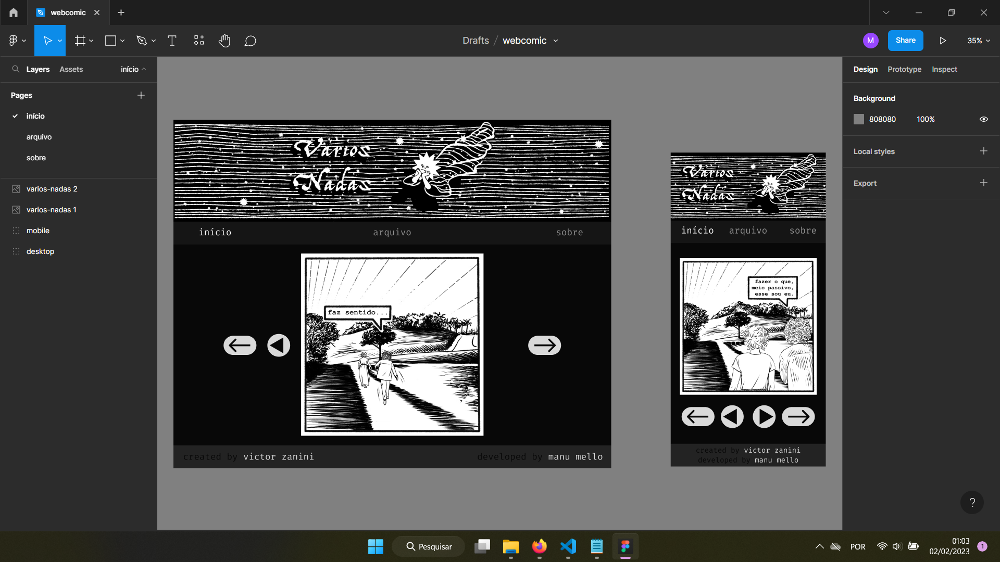

<h1>Vários Nadas</h1>

Para meu primeiro projeto, quis criar um site para ler webcomic. Tendo lido muitas, principalmente na adolescência, e sendo apaixonada por quadrinhos desde sempre, eu já queria fazer isso mesmo antes de sonhar em programar.

Como ainda não escrevi uma HQ na, e pra não fazer algo genérico, escolhi a série de tiras Vários Nadas, originalmente publicada no instagram e agora presente apenas no portfólio do autor que, sinceramente, não oferece a melhor experiência de leitura. O autor é um artista que eu admiro, além de amigo que eu amo, aliás, eu até tenho algumas aparições no meio desses quadrinhos, então quis honrar essa obra com um site bonito e funcional.

Minha inspiração veio de outros sites de webcomics que eu já li, e também da estética preto-e-branco da obra, trazendo no design um minimalismo na intenção de destacar os belos desenhos e a experiência de leitura.

Comecei criando o design das páginas no Figma, versão desktop e mobile,

mas na hora de desenvolver o código acabei optando por não seguir a máxima "mobile first", motivo de um certo arrependimento mais à frente no projeto.

Este é o site já terminado, completamente funcional e responsivo: https://manu-mello.github.io/varios-nadas/

Deixo aqui para que você saiba que no final deu tudo certo.

<h2>Agora, a saga:<h2>

Meu primeiro desafio foi implementar a qualidade <code>sticky</code> à barra de navegação - esse efeito que faz ela grudar no topo da página enquanto você navega utilizando a barra de scroll, por interferência da propriedade <code>overflow<code> causada pelo banner da página que dividia o cabeçalho com a barra de navegação, motivo que me levou a mover esse menu para fora do cabeçalho, deixando só o banner dentro da tag <code>header</code>.

Prontos o HTML e CSS básicos da página inicial com o lugar para a sequência de quadrinhos e os botões de navegação pelas páginas e tirinhas, a princípio sem saber como os tornaria responsivos utilizando JavaScript, mas fé. Aqui já percebi alguns problemas de responsividade, devido ao tamanho fixo da arte dos botões.

Escrevi também o código HTML e CSS das páginas de "arquivo" e "sobre", e parti para o JavaScript.

Depois de muita pesquisa no Stack Overflow e no DuckDuckGO, e de quebrar muito a cabeça, consegui fazer funcionar o botão de "próxima página"... e logo depois descobri que não bastava trocar ++ por -- para fazer funcionar o botão de "página anterior". Ele até funcionava, mas quebrava quando na página inicial. Um bug que esperou até o dia seguinte para ser resolvido.

Ainda era o primeiro dia de projeto, mas, depois de dedicar tantas horas da minha tarde e noite, eu queria o site 100% funcional.

Aí eu fiz uma gambiarra! HAHAHA

Sabia não ser nem de longe a melhor escolha de design, mas copiei a página inicial e fiz um index pra cada tirinha, 7 no total, HTML e JS pra cada uma, afinal não tinha planos de escalabilidade, e só queria tornar o site navegável em todas as opções que eu havia imaginado, inclusive a possibilidade de selecionar uma das tirinhas na página de arquivo ao clicar na imagem referente a ela. Isso também trouxe uma solução temporária para os botões de "próxima tirinha" e "tirinha anterior", e a versão beta do site estava completa, fiz o deploy no GitHub e compartilhei com uma amiga, empolgada com o que tinha conseguido fazer até então.

Depois de um longo descanso e outras aventuras, retornei ao projeto na noite seguinte e, com a cabeça fresca, consegui consertar o bug do botão de "tirinha anterior", e também encontrei uma solução muito mais graciosa em termos de design de código para os botões de navegação entre as tirinhas, que dispensou as 12 páginas extras de HTML e JS. Sucesso! Mas...

Isso criou um problema na página de arquivo: as âncoras em cada imagem obviamente pararam de funcionar, pois direcionavam para páginas que não existem mais. Enquanto reflito sobre a melhor solução, pensei em escrever essa documentação.

Deixei essa missão para o fim e finalmente ajustei o CSS para deixar o site totalmente responsivo.

